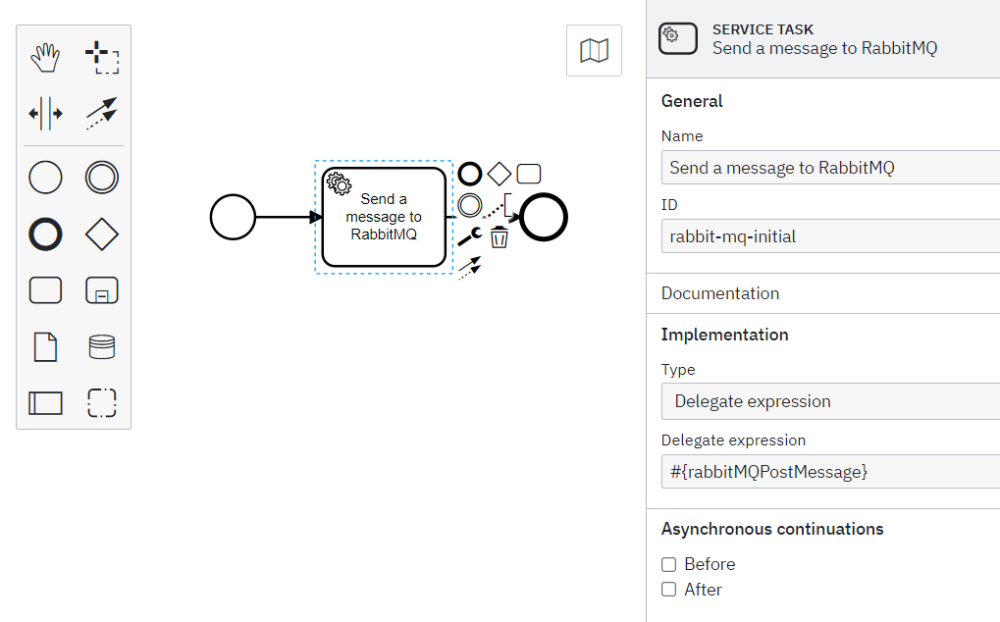

## Calling RabbitMQ queues from camunda
### Dependencies
We require **spring-boot-starter-amqp** dependency, Add the belwo entry in `pom .xml` #amqp-dependency

```xml
<dependency>  
  <groupId>org.springframework.boot</groupId>  
  <artifactId>spring-boot-starter-amqp</artifactId>  
</dependency>
```

### properties
In application.properties or application.yml we need to add the following entries
#rabbitmq-properties

```yml
rabbitmqHost: localhost  
rabbitmqPort: 5672
```

### Defining a delegate class
We can make an AQMP request from a delegate class

example:
```java
package com.camunda.workflow.adaptor;  
  
import org.camunda.bpm.engine.delegate.DelegateExecution;  
import org.camunda.bpm.engine.delegate.JavaDelegate;  
import org.springframework.amqp.core.Queue;  
import org.springframework.amqp.rabbit.core.RabbitTemplate;  
import org.springframework.beans.factory.annotation.Autowired;  
import org.springframework.scheduling.annotation.Scheduled;  
import org.springframework.stereotype.Component;  
  
@Component  
public class RabbitMQPostMessage implements JavaDelegate {  
    @Autowired  
    private RabbitTemplate template;  
    
    @Scheduled(fixedDelay = 1000, initialDelay = 500)  
    public void send() {  
        Queue queue = new Queue("testRunner");  
        String message = "Hello World!";  
        this.template.convertAndSend(queue.getName(), message);  
        System.out.println(" [x] Sent '" + message + "'");  
    }  
  
    @Override  
    public void execute(DelegateExecution ctx) throws Exception {  
        send();  
    }  
}

```

We can either define a configuration class for queue or initate a queue when required.
Queue instantiation can be done as `Queue queue = new Queue("testRunner");`

### Creating a custom config for queue
A custom configuration class can be added as below:
```java 
package com.camunda.workflow.configuration;  
  
import org.springframework.amqp.core.Queue;  
import org.springframework.context.annotation.Bean;  
import org.springframework.context.annotation.Configuration;  
  
@Configuration  
public class TestRunnerAQMPConfig {  
    @Bean  
    public Queue testRunner() {  
        return new Queue("testRunner");    }  
    @Bean  
    public TestRunnerAQMPConfig receiver() {  
        return new TestRunnerAQMPConfig();    }  
    @Bean  
    public TestRunnerAQMPConfig sender() { 
		return new TestRunnerAQMPConfig();    
	}
}  
```

### Attaching the delegate to a service task
- Under implementation we need to choose type as `delegate expression`
-  Under Delegate expression we need to write the delegate name as `#className`
	-   Class name should start with small letter, eventhough in the actual code it started with capital case.

