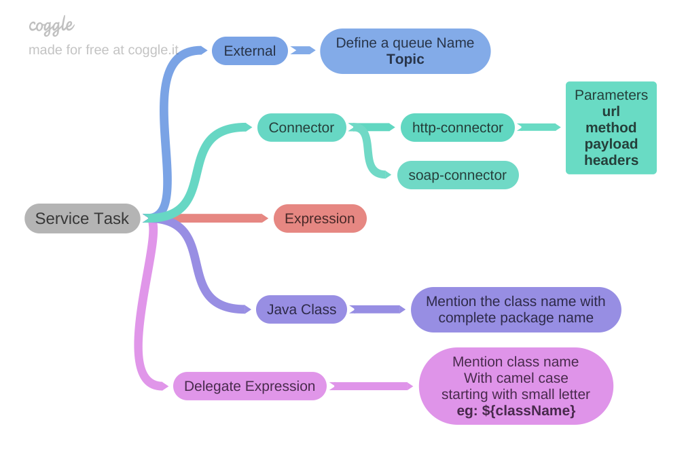

## Service tasks in camunda
When we add a new service task in a modeler, we can choose it's implementation from the below options. External, Java Class, Expression, Delegate Expression, Connector

**http-connector:**
- Used to make a http call from a service task generally waits until the task is completed.
- It accepts few parameters url, method, payload, headers
- In headers we can pass parameters like accept, content-type, auth etc.
- method will have values like POST / PUT / GET / DELETE and other http status
- payload can be a json body
- url will hold the endpoint for a resource something like a `http://localhost:9090`

>[!note]
>When you want to pass a json using http connector, you must mention the `Content-Type` parameter as `application/json`

External Task:

- Used when an external operation will take time to perform an operation.
- Specify a queue name in which the external task will be pushed to under the topic section.