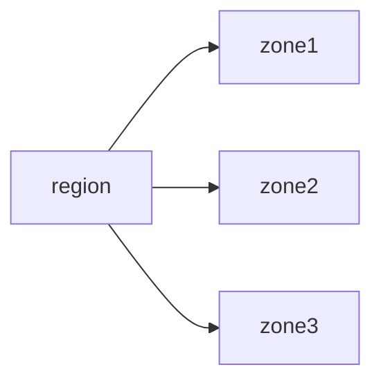

# Regions and zones

- Regions and zones are logical grouping of datacenters by cloud providers.
- Generally a region is a geographical location like  a country.
- A country might have multiple regions and under each region there will be zones.

>[!Note]
> Zones in a cluster are connected with low latency links

- Regions provide high availability
- If you prefer to have high availability with single region, you can still achieve it with multiple zones.
- GCP provide more than 20+ regions and it keeps on increasing.