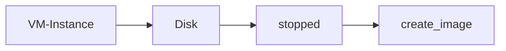

# Google compute

## Google compute Engine

- To provision virtual machines GCE is used.
- GCE manages life cycle of virtual machines.
- Storage can be attached to VM
- Load balancing and autoscaling for multiple VMs
- Manage Network connectivity and configuration for Virtual machines.

- To create a VM instance lots of details are required we can 
	- add name
	- labels
	- Select region and zone
	- Select the hardware to run machine compute optimized or memory optimized.
	- Choose operating system image.
	- allow http and https traffic based on requirement and then click create

## Types of IP addresses:

- Internal IP address: This is the internal Ip address for the VM with in the GCP network, it will stay with the machine until the VM instance is deleted. With this IP address we cannot access the machine via internet.
- External Ip address: This ip address is used to access the VM vi internet. This IP address will be changing when the machine stopped and started again. Hence these IP addresses are ephemeral.
- Static IP address: This is an IP address as external IP to a virtual machine but this address will not change when the virtual machine restarts. 

>[!Info]
>Static IP addresses can be created from VPC. These are billed when the IP is not in use by any resource.

Sometimes we might need some software preinstalled in a VM or have few things setup earlier before making use of the VM this can be achieved with help the the help of following during creation of a VM.

- Startup script
- Instance template
- Custom Images 

### Startup script

- While creating a VM in GCP under the management section we can add a startup script
- Start up script can be bash script to install something like an nginx server or to just update the OS.
- This will be run every time a machine restarts.

### Instance template

- An instance template is a predefined set of options while creating a VM on GCP
- Instance templates can be created from compute section
- A startup script also can be associated with an instance template.
- When creating VMs with instance templates the names of them will appear as instance_template_name_1

### Custom Image

- Custom image can be created from an instance, persistent disk, a snapshot, another image or from cloud storage.
- Custom images will be created from disks attached to a VM
- To create a custom image it is recommended to do so after stopping the instance.
- Custom images appear under compute/storage/images

