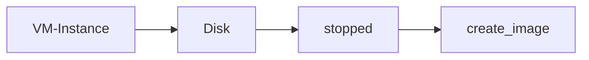

# Google compute

## Google compute Engine

- To provision virtual machines GCE is used.
- GCE manages life cycle of virtual machines.
- Storage can be attached to VM
- Load balancing and autoscaling for multiple VMs
- Manage Network connectivity and configuration for Virtual machines.

- To create a VM instance lots of details are required we can 
	- add name
	- labels
	- Select region and zone
	- Select the hardware to run machine compute optimized or memory optimized.
	- Choose operating system image.
	- allow http and https traffic based on requirement and then click create

## Types of IP addresses:

- Internal IP address: This is the internal Ip address for the VM with in the GCP network, it will stay with the machine until the VM instance is deleted. With this IP address we cannot access the machine via internet.
- External Ip address: This ip address is used to access the VM vi internet. This IP address will be changing when the machine stopped and started again. Hence these IP addresses are ephemeral.
- Static IP address: This is an IP address as external IP to a virtual machine but this address will not change when the virtual machine restarts. 

>[!Info]
>Static IP addresses can be created from VPC. These are billed when the IP is not in use by any resource.

Sometimes we might need some software preinstalled in a VM or have few things setup earlier before making use of the VM this can be achieved with help the the help of following during creation of a VM.

- Startup script
- Instance template
- Custom Images 

### Startup script

- While creating a VM in GCP under the management section we can add a startup script
- Start up script can be bash script to install something like an nginx server or to just update the OS.
- This will be run every time a machine restarts.

### Instance template

- An instance template is a predefined set of options while creating a VM on GCP
- Instance templates can be created from compute section
- A startup script also can be associated with an instance template.
- When creating VMs with instance templates the names of them will appear as instance_template_name_1

### Custom Image

- Custom image can be created from an instance, persistent disk, a snapshot, another image or from cloud storage.
- Custom images will be created from disks attached to a VM
- To create a custom image it is recommended to do so after stopping the instance.
- Custom images appear under compute/storage/images

- Instance template can start using the custom image created.

### Reducing costs for using VM

- Sustainable use discounts: When the resources are used for more than 25% of time in a month discounts will be automatically added. The discounts will on the resources used above 25% time.
- Committed Use Discounts: When your organizations commits to use resources for more than 3 years, you will be getting additional discounts, the time may vary.
- Preemptible VM: These are used for fault tolerant resources, these VMs will live for maximum of 24 hours. these VMs can be taken down with a notice of 30 seconds.

> [!Warning]
> Preemptive VMs can never be converted to normal VMs, Preemptive VMs might not be available all the time.

Spot VMs are latest type of preemptible VMs, the only difference is that they can run for longer time more than 24hrs. These provided discounts from 60 to 90%.

### Sole Tenant Nodes

If your project requires to have dedicated Hardware which should not be used by any other projects or organizations with in cloud, then you need to use sole tenant nodes. These can be requested from the compute section.

By default host machines are shared by other projects and tenants.

## Custom machine types

- When the predefined machine types are not as per requirement you can choose custom machine types.
- Example you do not want to use E2, E1, N1..,  types you can then choose the number of cores and memory required.
- Billing will be done as per the core provisioned and the memory used.

>[!Info]
>VM hosting will incur infrastructure and licensing cost for Operating system.
>Existing license can be used.

## Instance Groups

- Logical grouping of VMs are instance groups.
- There are two kinds of instance groups:
	- Managed Instance groups
	- Un-Managed Instance groups

### Managed Instance groups

- Managed instance groups are created from an instance template
- These can manage a specific number of VMs at all time.
- If one of the vm crashes, it will be replace by another.
- A health check can be configured. If any VM's health check fails it will be replace by another vm.
- Load balancer can be attached to the MIG for load distribution.
- There can be multi regional MIGs and multi Zonal Migs.
- Releases can be incremental or canary.

- Instance template is mandatory for creating a MIG
- Auto scaling :
	- Minimum number of instances
	- Maximum number of instance
	- Auto scaling configuration is done with help of `stack driver` which will check for CPU utilization or memory utilizations
- There are stateful and stateless MIGs
- Use stateful for persistent data like database
- For stateless services like rest API services.

### Unmanaged instance groups

- Individual VMS are created with different configurations
- These individual VMS are then grouped to create a an unmanaged instance group.

## Load balancing

- To distribute traffic across VMs based on the load of each vm.
- load balancer can be accessed from network-services
- To create a load balancer:
	- Define backend: Backend can be an instance group
	- Define host and path rule: Which path on host need to be sent to which path of service. example host/app should be sent to localhost:8080
	- Define the front end: Front end in the network facing part, the actual IP which will be exposed.
- Load balancer will take time to create
- Traffic distribution can also be configured.
- Load balancers can distribute loads across regions.