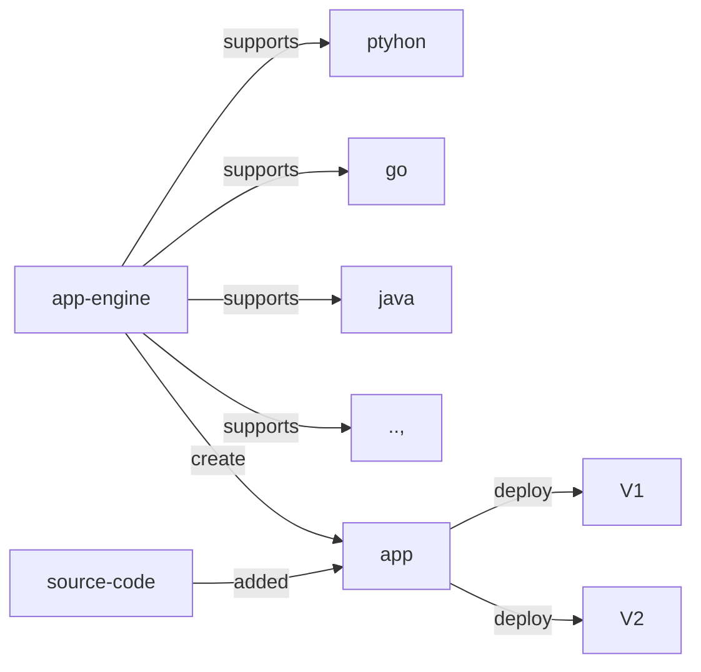
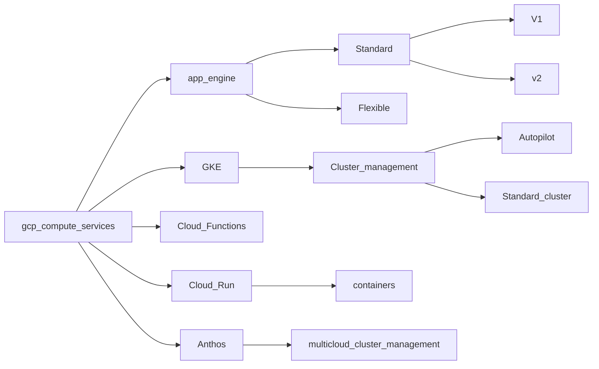

# GCP compute services

## GCP App Engine
#app-engine

A PaaS which is used to run code related to multiple languages, App engine will take care of autoscaling and versioning. There are two types of environments for App Engine.

### Standard

- Under standard there are 2 versions
	- V1 use this for older version runtime of Java, python..,
	- V2 newer version of runtime for java, python etc.,
- Provides complete isolation from infrastructure
- Supports scale down to zero

### Flexible

- Makes use of compute engine virtual machines
- Supports any runtime
- App instances run on docker containers
- Cannot scale down to zero

>[!Info]
>App engine does not include any additional cost, except the cost to the resources provisioned.

### How do we create a app in app engine

- Navigate to app engine 
- Create an app, choose the runtime
- In the source code root place an `app.yaml` with the configuration for app.
- Use gcloud cli to deploy the app.
- App can be deployed for multiple versions of same app.
- App engine should have permission for cloud storage service.



command to deploy app: Run it in the root directory of app.

```shell
gcloud app deploy
```

## Google Kubernetes Engine
#GKE

- Kubernetes is a container orchestration software.
- GKE is google provided managed Kubernetes service
- There are 2 type
	- Auto-pilot: delegated cluster management to GKE
		- This is used to reduce the costs.
	- Standard: Users need to manage cluster management

### Creating a cluster: 

- Navigate to clusters in GCP
- Click on create cluster choose the type
- All gcloud cli command for GKE will start as `gcloud container cluster create`

- Once cluster is created, users can add deployments, service, all Kubernetes resources.
- Users can even install helm charts on the cluster, below are some reference commands.

```shell
gcloud config set project my-kubernetes-project-304910

gcloud container clusters get-credentials my-cluster --zone us-central1-c --project my-kubernetes-project-304910

kubectl create deployment hello-world-rest-api --image=in28min/hello-world-rest-api:0.0.1.RELEASE

kubectl get deployment

kubectl expose deployment hello-world-rest-api --type=LoadBalancer --port=8080

kubectl get services

kubectl get services --watch

curl 35.184.204.214:8080/hello-world

kubectl scale deployment hello-world-rest-api --replicas=3

gcloud container clusters resize my-cluster --node-pool default-pool --num-nodes=2 --zone=us-central1-c

kubectl autoscale deployment hello-world-rest-api --max=4 --cpu-percent=70

kubectl get hpa
```


## Google Cloud Functions
#cloud-function #depricated

> Cloud function is now part of cloud run.

- Functions are used when your code should run in response to a specific event.
- Example like a log file is updated, a message is received in pub-sub
- Billing is done per invocation, compute time and the resources provisioned.
- An invocation is time bound defaulted to 1 minute, extended maximum up to a max of 9 minutes.
- Each execution runs in a different instance.
- Function can be tested on demand


## Cloud Run

- Cloud run is marketed as container to market in seconds.
- Create a docker image, push to repository.
- Use it to deploy in cloud run.
- Zero infrastructure maintenance.
- Pay as you use.
- No limitations on programming languages.

For creating:

- Choose a service name and region 
- CPU can be always allocated or bring up CPU while request invocation.
- Cloud run might have a cold start issue.
- We will create a cloud run service, it will have revisions for each deployments.
- Cloud run integrates withs cloud build, cloud logging.
- Supports yaml based deployments.


## Anthos
#Anthos

- Run Kubernetes anywhere
- Nodes can be in cloud, on prem or multi-cloud.

Cloud run for Anthos is to deploy work loads to Anthos clusters running on-premises or on Google cloud


Summary:



