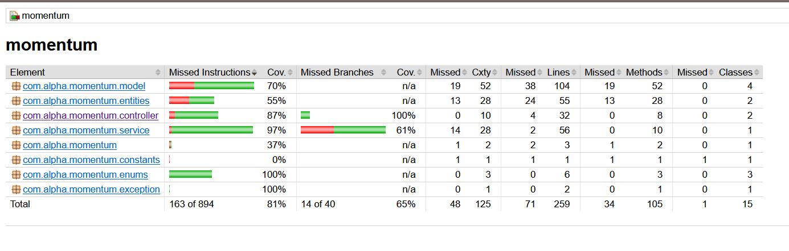

## Jacoco
Jacoco is a **java code coverage library**.

> [!Info] Code Coverage
> **Code coverage** is a software metric used to measure how many lines of our code are executed during automated tests.

## Maven Config
- To add in your project just add the following section under your plugins.
- To get the latest version navigate to [Jacocco-Maven](https://mvnrepository.com/artifact/org.jacoco/jacoco-maven-plugin)

```xml
<plugin>
    <groupId>org.jacoco</groupId>
    <artifactId>jacoco-maven-plugin</artifactId>
    <version>${jacoco.version}$</version>
    <executions>
        <execution>
            <goals>
                <goal>prepare-agent</goal>
            </goals>
        </execution>
        <execution>
            <id>report</id>
            <phase>prepare-package</phase>
            <goals>
                <goal>report</goal>
            </goals>
        </execution>
    </executions>
</plugin>
```

## Getting Code Coverage and Reports
- Add unit test to your code.
- Running the test using JUnit will automatically set in motion the JaCoCo agent.
- It will create a coverage report in **binary format** in the target directory, _target/jacoco.exec._
- The created report will not be in human readable format, but code quality tools like sonar can read them.
- we can use the _jacoco:report_ goal in order to generate readable code coverage reports in several formats, like HTML, CSV, and XML.
- Once report is generated it will be under `target/site/jacoco/index.html`.



## Report Analysis
JaCoCo reports help us visually analyze code coverage by using diamonds with colors for branches, and background colors for lines:

-   **Red diamond** means that no branches have been exercised during the test phase.
-   **Yellow diamond** shows that the code is partially covered – some branches have not been exercised.
-   **Green diamond** means that all branches have been exercised during the test.

The same color code applies to the background color, but for lines coverage.

JaCoCo mainly provides three important metrics:

-   **Lines coverage** reflects the amount of code that has been exercised based on the number of Java byte code instructions called by the tests.
-   **Branches coverage** shows the percent of exercised branches in the code, typically related to _if/else_ and _switch_ statements.
-   **Cyclomatic complexity** reflects the complexity of code by giving the number of paths needed to cover all the possible paths in a code through linear combination.

To take a trivial example, if there are no _if_ or _switch_ statements in the code, the cyclomatic complexity will be 1, as we only need one execution path to cover the entire code.

Generally, the cyclomatic complexity reflects the number of test cases we need to implement in order to cover the entire code.

## How It works
JaCoCo runs as a **Java agent.** It's responsible for **instrumenting the byte code** while running the tests. JaCoCo drills into each instruction, and shows which lines are exercised during each test.

To gather coverage data, JaCoCo uses [ASM](http://asm.ow2.org/) for code instrumentation on the fly, receiving events from the [_JVM Tool Interface_](https://docs.oracle.com/en/java/javase/11/docs/specs/jvmti.html) in the process.

It's also possible to run the JaCoCo agent in server mode. In this case, we can run our tests with _jacoco:dump_ as a goal in order to initiate a dump request.

## Setting Code-Coverage requirement
In a real world project, as developments go further, we need to keep track of the code coverage score.

JaCoCo offers a simple way of declaring **minimum requirements** that should be met, otherwise the build will fail.

We can do that by adding the following _check_ goal in our `pom.xml` file:

```xml
<execution>
    <id>jacoco-check</id>
    <goals>
        <goal>check</goal>
    </goals>
    <configuration>
        <rules>
            <rule>
                <element>PACKAGE</element>
                <limits>
                    <limit>
                        <counter>LINE</counter>
                        <value>COVEREDRATIO</value>
                        <minimum>0.50</minimum>
                    </limit>
                </limits>
            </rule>
        </rules>
    </configuration>
</execution>
```

As we can see, we're limiting the minimum score for lines coverage to 50%.

The `jacoco:check` goal is **bound** to _verify_, so we can run the Maven command `mvn clean verify` to check whether the rules are respected or not.