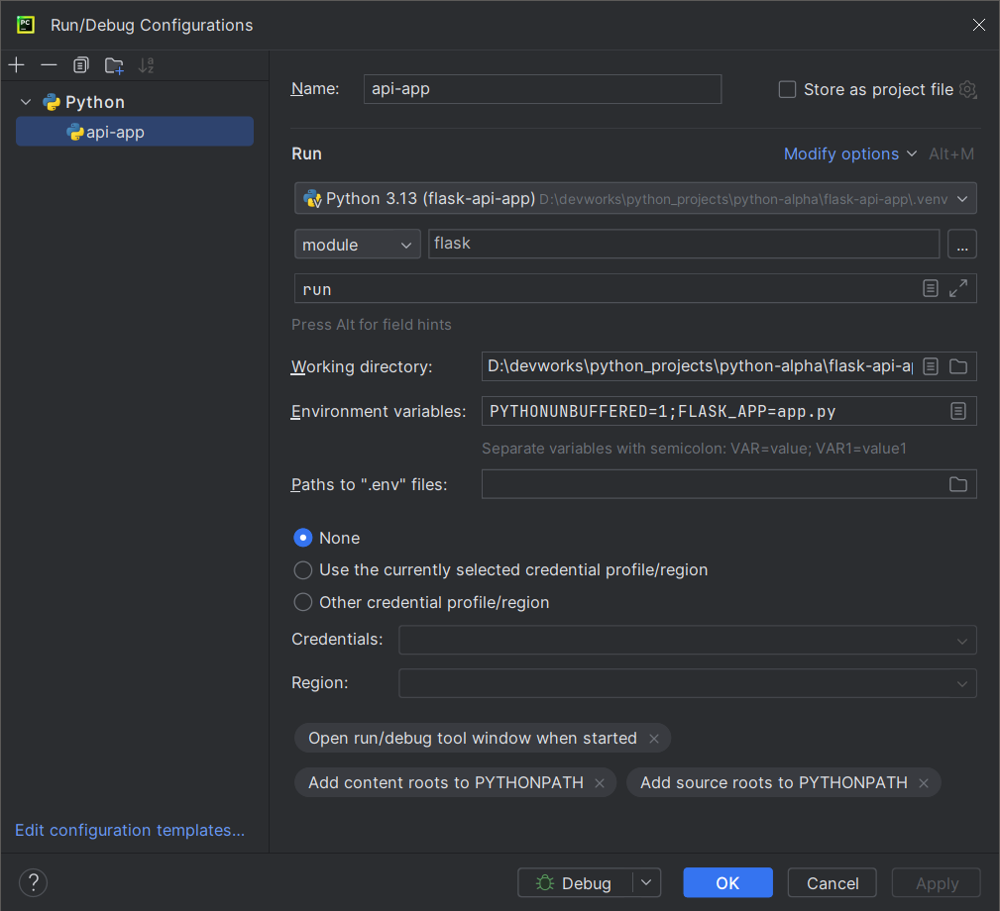
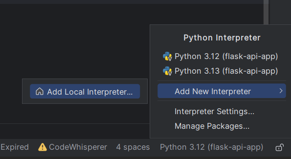

## Running a Flask app on PyCharm community edition

- Create a virtual environment `python -m venv .venv` at root folder.
- Set the python interpreter to virtual environment python.exe present in Scripts folder.
- Add a new python app configuration.
- Provide a name
- Instead of script choose module and search for flask and add it.
- Set work directory as the project directory not the path for flask or python executable
- Add a new environment variable `FLASK_APP=<Name_of_app_file.py>`

#Setting-Interpreter

