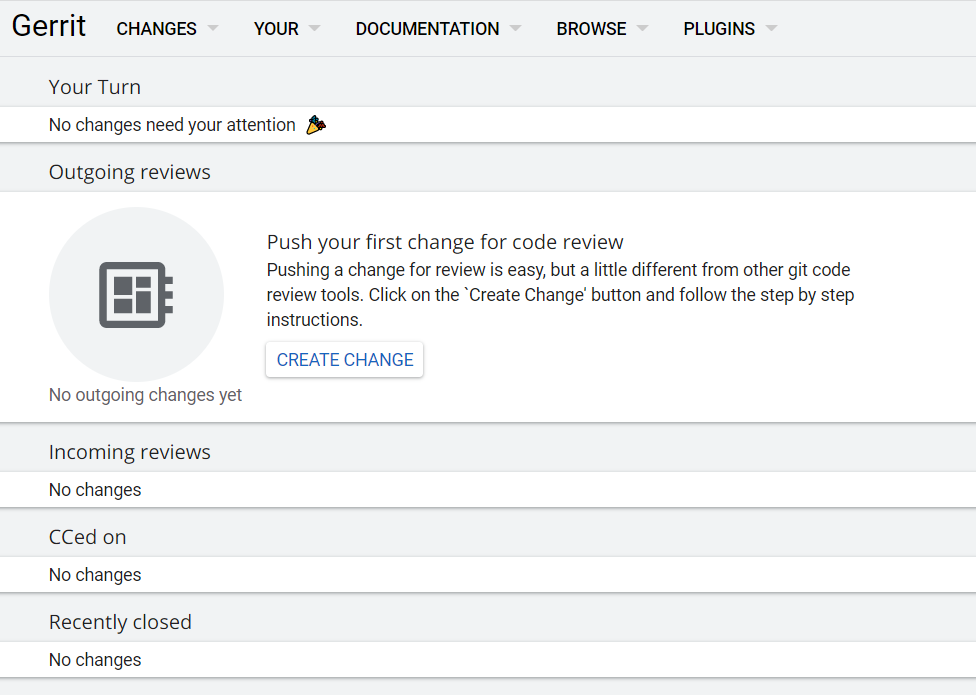

## Installation

- Can be installed using docker image.
- Gerrit official image: https://hub.docker.com/r/gerritcodereview/gerrit
- The below command runs gerrit on port 8080 over host machine.

```
docker run -ti -p 8080:8080 -p 29418:29418 gerritcodereview/gerrit
```

Docker-compose for gerrit:

```yaml
version: "3"

services:
  gerrit:
    image: gerritcodereview/gerrit
    volumes:
      - git-volume:/var/gerrit/git
      - index-volume:/var/gerrit/index
      - cache-volume:/var/gerrit/cache
    ports:
      - "29418:29418"
      - "8080:8080"

volumes:
  git-volume:
  index-volume:
  cache-volume:
```

Docker run command with volumes, the below command runs on port 9095 of host machine.

```commandline
docker run -d -p 9095:8080 -p 29418:29418 --name gerrit -v git-volume:/var/gerrit/git -v index-volume:/var/gerrit/index -v cache-volume:/var/gerrit/cache gerritcodereview/gerrit
```

After Installing you will get an initial screen as below:


On clicking Install plugins, it will shown all the list of plugins, and additional plugins that can be installed.
Once those are installed you can click on `Done >> Go To Gerrit`.


