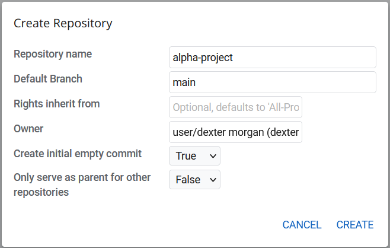
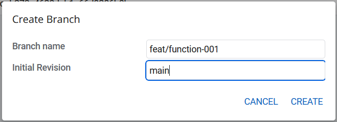
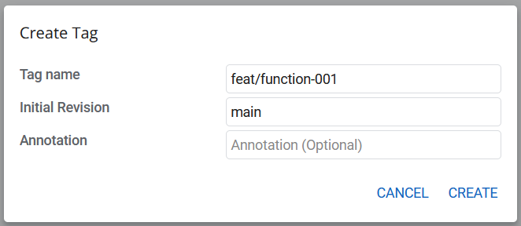

## Creating a Project
- Navigate to Browse > Repositories > Create New
- A pop up will appear as shown below

- Enter repository name of your choice
- select a default branch main or master
- Inherit the right as it is an optional field leave it as it is.
- In the owner textbox choose the owner name.
- Set the 'Create initial commit' to true.
- Only serve as parent: meaning this repo will be used as a parent repo for other repos so choose the option based on your need.
- Click on cerate and it will create a new project.

## Creating branches and Tags
- Branches and tags can be created by git push command or from gerrit UI
- To create a new branch, click on branches from project page
- Click on create new a pop up will appear as below

Provide Branch name and which branch it should be created from, then click create.

## Creating tags 
- Tags can also created in the same way.
- Click on Create New and provide information and click create

