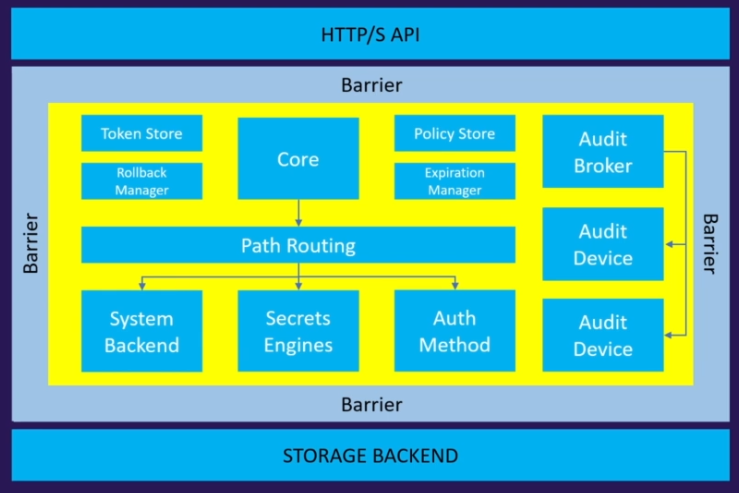

    ## Vault Components

Below mentioned are the core components of vault.

### Storage Backends
#storage-backend
Place where vault stores it's data in encrypted form, In an enterprise environment generally it will be raft or consul. Other cases it will be some data base.
- Configures Location for storage of vault data
- Storage configuration is defined in the main vault configuration file with desired parameters.
- All data is encrypted in transit with TLS and at-0rest using AES256.
- Depending up on the storage backend chosen we can get high availability, or tools for management and data protection.
- There will be only one storage back-end per vault cluster.

### Secret Engines
#secret-engine
Basically the heart of what vault does, vault is being used to make use of secret engines. These store, encrypt or generate data. 
- These are responsible for managing the secrets for your organization.
- Secret engines can store, generate or encrypt data
- Secret engines connect to other services to generate dynamic credentials on-demand.
- Many secret engines can be enables and used as per the requirement
	- Even multiple secret engines of same type can be enabled with different paths
- Secret engines are enabled and isolated at a "path"
	- All interactions are done directly with the path

### Authentication methods
#auth-method
In order to use secret engines we need to authenticate first with vault, There are multiple ways to authenticate with vault. Once authenticated a token will be generated to access secret engines.
- These components perform authentication and manage identities.
- Responsible for assigning identity and policies to users.
- Multiple authorization methods can be enabled based on requirement
	- authorization methods can differentiate human vs machine
- Once authenticated a token will be issued which can be used to perform future operations.
	- main aim of all authorization methods is t get a token.
	- Each token will have an associated policy or policies and a time to live (TTL)
- Default authentication method for a new vault deployment is **tokens**

### Audit Devices
#audit-device
As vault is a security software we need audit devices to make sure everything is 100% audited and logged properly.
- These keep a detailed log of all requests and responses to a Vault.
- Audit log is formatted using a JSON
- Sensitive information is hashed before logging
- It is preferred to have more than one audit enabled devices
	- Vault requires at least one audit device to write the log before completing the Vault request - If an audit device is enabled.
	- Vault prioritizes safety over availability, meaning if it is not able to write a log due to some issues like insufficient storage for logs it will not respond to request.

## Vault Architecture and Pathing Structure

The center part which is encapsulated in the Barrier are the components inside vault. To access vault a HTTP/s api is available, to store data from vault an external storage backend will be used like consul or PostgreSQL or MySQL.

To access Vault the api should get authenticated or it should have a token.

## vault paths
- Everything in vault is path based
- Path prefix helps vault to understand which component a request need to be routed.
- Secret engines, auth methods, and audit devices are mounted at a specified path
	- These are often referred as a mount.
- paths available are dependent on the features enabled in the vault like auth methods and secret engines.
- System backend is a default backend  in vault which is mounted at the `/sys` endpoint.

- vault components can be enabled at any path as per your desire using the `-path` flag
	- Each path has a `default path`, which can also be used.
- Some paths are system reserved and they cannot be used or removed.

| Path Mount Point | Description |
| --- | --- |
| auth/ | Endpoint for auth method configuration |
| cubbyhole/ | Endpoint used to Cubbyhole secrets engine |
| identity/ | Endpoint for configuring Vault identity (entities and groups) |
| secret/ | Endpoint used by key/Value v2 secrets engine if running in dev mode |
| sys / | System endpoint for configuring Vault |

