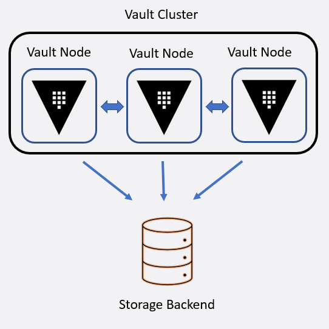

# Storage Backend

- Configures the location of storage backend.
- Open-source users can choose a storage backend based on their preference
- Enterprise Vault Clusters should use HashiCorp Consul or Integrated Storage
- Everything else is community supported and can be used for open-source.

Storage Backends Supported many backends like consul, MySQL, PostgreSQL, in memory, many more.
The complete list of those can be found at https://www.vaultproject.io/docs/configuration

- Every Vault node will have one Storage Back-end
- If we want to create a cluster, few additional vault nodes are spawn but they also will connect to the same storage backend.
- At any point of time one vault node will be active and others will be in standby.



- If multiple clusters are deployed and replication is enabled which is an enterprise feature. Storage backend will not be shared only vault nodes will enable replication.
- Every Vault Cluster has its own storage backend and they will never be replicated.


## How do we choose storage backend?

- Non-Production
	- If it is not for a production user **In-Memory**
- Production
	- Need High Availability
		- Not HashiCorp Enterprise Enterprise Version
			- Dynamo DB
			- Etcd
			- Foundation DB
			- Google cloud Spanner
			- Google Cloud Storage
			- MySQL
			- PostgreSQL
			- Zookeeper
		- HashiCorp Enterprise Enterprise Version
			- Consul
			- Raft
	-  High Availability Not Required
		- Not HashiCorp Enterprise Enterprise Version
			- Azure
			- Cassandra
			- Cockroach DB
			- Couch DB
			- Manta
			- MSSQL
			- S3
			- Swift
		- HashiCorp Enterprise Enterprise Version
			- Filesystem

### Storage Backend Configuration:

For Consul:
```
storage "consul" {
	address = "127.0.0.1:8500" # IP/Port of consul agent
	path    = "vault/"         # Path in Consul K/V to store Vault Data
	token   = "aslydglsiygihsfigsdfuhsgboisudgoy"    # Consul Access Token
}
```

For Raft or integrated Storage
- RAFT is a protocol, consul also uses raft protocol
```
storage "raft" {
	path    = "/opt/vault/data"     # Local path to storage replication data
	node_id = "node-a-us-est-1.example.com"  # name and id of node
	retry_join {
		auto_join = "provider=aws region=us-east-1 tag_key=vault tag_value=us-eats-1"
	}
}
```
Auto join is for mentioning cluster joining option.
