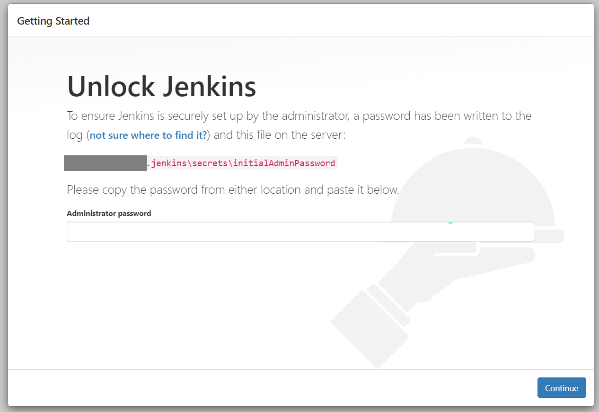
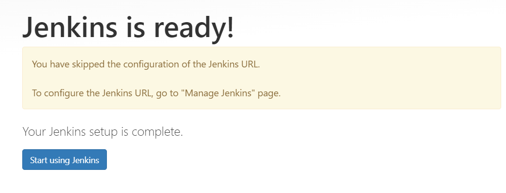

## Prerequisites
- Install Java JDK and set path parameters.
- To verify them use `java --version` and `javac --version` both should show a version number that is installed.

## Jenkins Installation
- There are many ways for installing Jenkins, more information available at https://www.jenkins.io/download/
- Easiest way is to run it as a jar.
- Download the jar package
- From a terminal navigate to the path where jar is present, use the following command to start it

```commandline
java -jar jenkins.jar
```
- While starting for the first time it will show a password in the terminal
- The path to the location for password file is also shown. Copy it and enter it.



>[!Note]
> On the plugins screen choose 'Install Suggested Plug-ins'

- It will take sometime and install those plugins.
- On the Create admin user page add your credentials which will be used to log in to Jenkins from next time.
- You can skip Jenkins URL configuration.
- You should see a Jenkins is ready message.


Click on start using Jenkins you will be presented the home screen.