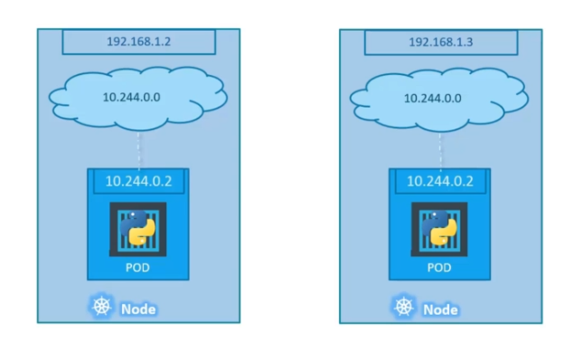

# Networking in Kubernetes

## Consider a single node cluster

- A node will have an IP address
- A pod inside the node will have an IP address

> In Docker each container gets its own Ip but in kubernetes only the Pod gets an IP address

If we are using Minikube, minikube instance on hypervisor will have its own Ip and the pods inside will get an Ip each.

When a node is created a Virtual private network is created inside it. Each pod inside the node will be assigned an Ip address. We can access the pods using the Ip address, but it is not advised as the ip address's change when updates or restarts happened.

## Cluster Nodes networking

- Consider a two node cluster
- Each node has its own ip address and a VPN in it then an ip address is assigned to each node
- The same thing happens in another node as well.
- This might cause an ip address conflict. 
- Kubernetes expects the user to configure this

Kubernetes Expects:
- All containers and pods can communicate to one another without NAT
- All nodes can communicate with all containers and vice-versa without NAT

Kubernetes expects users to set up a networking solution that follows this criteria.
There are few pre built solutions
- Cisco ACI networks
- vmware NSX
- Cilium 
- Flannel
- Big cloud Fabric
- Calico
- Weave Net

Once we set a networking solution which create a network of pods and nodes which have their own ip address then we can start using the kubernetes clusters.