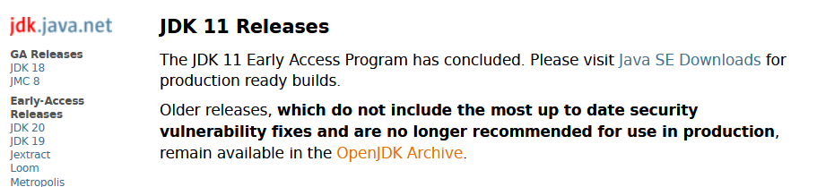
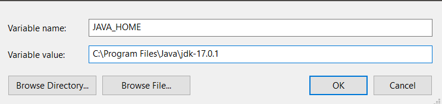
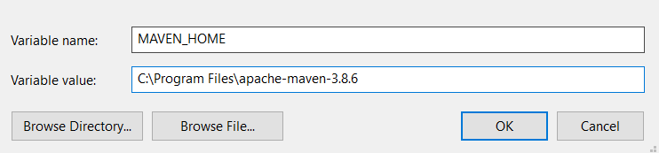
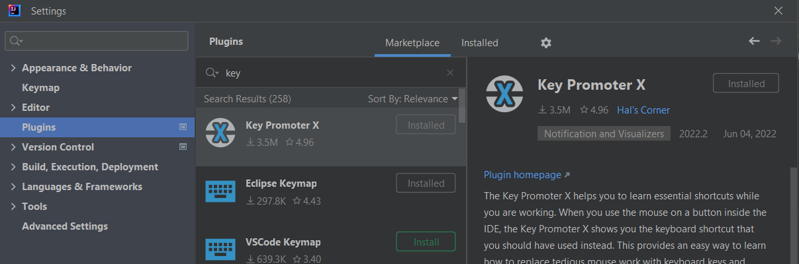
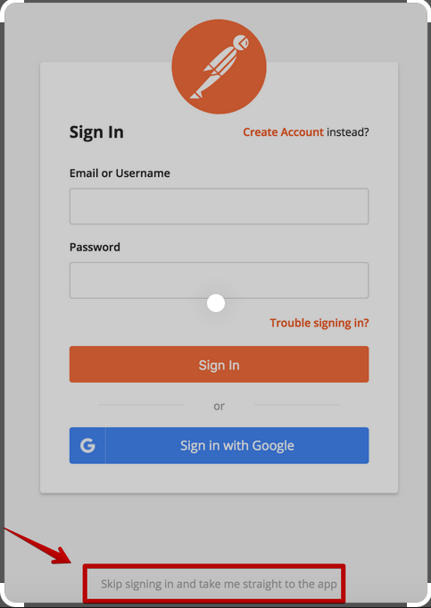

## Setting up workspace for working on spring boot applications
#on-windows-machine #workspace-setup

### Things to install 
- [ ] JDK (preferably OpenJDK)
- [ ] Maven
- [ ] IDE 
- [ ] Postman
- [ ] Setting Environment variables

**Optional:**
- [ ] Visual studio code with Open-api plugin 

### OpenJDK
- Navigate to https://openjdk.org/install/
- Choose the JDK version you want example OpenJDK 11 use https://jdk.java.net/11/
- Click on the Open JDK Archive and download the package related to your operating system.

- Extract the archive to the your preferred location
- Navigate the up to bin path in extracted folder and copy the path.
- Add the path to System or User environment variable. example: `C:\Program Files\Java\jdk-17.0.1\bin`
- Add a new Environment variable as `JAVA_HOME` add the value as jdk extracted path example `C:\Program Files\Java\jdk-17.0.1`
#java_home

### Maven
- Navigate to https://maven.apache.org/download.cgi
- Scroll down and download the zip archive 
- Extract it to a location of your choice
- Add the bin folder to path variable. example `C:\Program Files\apache-maven-3.8.6\bin`
- Add a new environment variable named `MAVEN_HOME` and add the extracted location example `C:\Program Files\apache-maven-3.8.6`

### Installing Intellij Idea
- Navigate to https://www.jetbrains.com/idea/download/#section=windows
- Download the community edition and install it with all default selection.
- If you like to practice the shortcuts, install plugin https://plugins.jetbrains.com/plugin/9792-key-promoter-x
- You can install it by navigating to file > settings > plugins > marketplace> search for key prompter x > click on install

### Installing Postman
- Navigate to https://www.postman.com/downloads/
- Download and install postman
- When using for the first time, it will ask to register "No need to register"
- Below there will be an option to skip which is very small click on it and start using postman.

> [!Note]
> Optionally if you are editing open-api specs you can install visual studio code from https://code.visualstudio.com/
> Add plugin: https://marketplace.visualstudio.com/items?itemName=42Crunch.vscode-openapi
